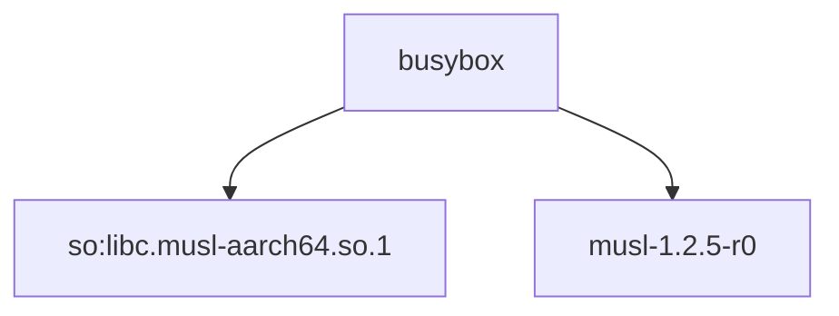

# Dependency Graph Visualizer for Alpine Linux Packages

## Описание задания

Разработать инструмент командной строки для визуализации графа зависимостей, включая транзитивные зависимости. Сторонние средства для получения зависимостей использовать нельзя.
Зависимости определяются по имени пакета ОС Alpine Linux (apk). Для описания графа зависимостей используется представление Mermaid. Визуализатор должен выводить результат на экран в виде кода.

### Ключами командной строки задаются:
- Путь к программе для визуализации графов.
- Имя анализируемого пакета.
- Путь к файлу-результату в виде кода.
- Максимальная глубина анализа зависимостей.

Все функции визуализатора зависимостей должны быть покрыты тестами.

## Особенности выполнения задания

Проект разрабатывался на MacBook с использованием Docker, так как Alpine Linux и команда `apk` изначально не поддерживаются в macOS. Docker позволил создать контейнер с Alpine Linux, где можно было тестировать выполнение команд для анализа зависимостей.

## Описание проекта

Этот проект представляет собой инструмент командной строки для визуализации графа зависимостей Alpine Linux пакетов с использованием представления Mermaid. Инструмент позволяет анализировать зависимости пакетов, включая транзитивные зависимости, и генерировать граф, описывающий связи между пакетами.

## Основные функции
- **get_dependencies(package_name, max_depth)**: Функция для рекурсивного получения зависимостей пакета с использованием команды `apk info -R`.
- **generate_mermaid(package_name, dependencies)**: Функция для создания кода графа зависимостей в формате Mermaid.

## Использование

Пример использования инструмента:

```sh
python dependency_visualizer.py --graph-path /path/to/graph/tool \
    --package-name busybox \
    --output-file output.md \
    --max-depth 3
```

- **--graph-path**: Путь к программе для визуализации графов.
- **--package-name**: Имя анализируемого пакета (например, `busybox`).
- **--output-file**: Путь к файлу, куда будет сохранен результат в формате Mermaid.
- **--max-depth**: Максимальная глубина анализа зависимостей (по умолчанию 3).

## Пример вывода

При запуске с пакетом `busybox`, результат в файле будет выглядеть следующим образом:



На изображении ниже представлен пример визуализированного графа зависимостей с использованием Mermaid:


## Тестирование

Для тестирования функций используется `unittest`. Тесты покрывают функции получения зависимостей и генерации графа.

### Запуск тестов

```sh
python -m unittest test_dependency_visualizer.py
```

## Пример тестов

```python
import unittest
from unittest.mock import patch
from dependency_visualizer import get_dependencies, generate_mermaid

class TestDependencyVisualizer(unittest.TestCase):
    @patch('subprocess.run')
    def test_get_dependencies(self, mock_subprocess_run):
        mock_subprocess_run.return_value.stdout = (
            "fake-package depends on:\n"
            "    dependency1\n"
            "    dependency2\n"
        )
        dependencies = get_dependencies("fake-package", 1)
        self.assertEqual(dependencies, ["dependency1", "dependency2"])

    def test_generate_mermaid(self):
        dependencies = ["libc", "busybox"]
        mermaid_code = generate_mermaid("alpine-baselayout", dependencies)
        self.assertIn("alpine-baselayout --> libc", mermaid_code)
        self.assertIn("alpine-baselayout --> busybox", mermaid_code)

if __name__ == '__main__':
    unittest.main()
```

## Особенности использования Docker

Так как разработка велась на Mac, для выполнения команд `apk` использовался Docker. Ниже приведены инструкции по запуску Docker-контейнера с Alpine Linux для тестирования:

1. Скачайте образ Alpine Linux:
   ```sh
   docker pull alpine
   ```

2. Запустите контейнер:
   ```sh
   docker run -it alpine
   ```

3. В контейнере вы сможете использовать команду `apk` для установки и проверки зависимостей пакетов.

Это позволяет обеспечить совместимость и возможность тестирования в окружении, максимально приближенном к Alpine Linux.

